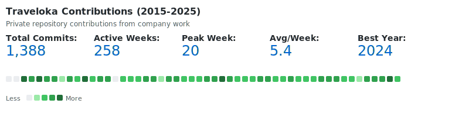

## Hi there, I'm Ferry Hinardi! 👋

Frontend Engineer specializing in ReactJS & React Native, with over 11 years of software engineering experience since 2013. Currently building innovative tools and contributing to large-scale applications at **Traveloka**.

### 🚀 Professional Experience

**Frontend Engineer @ Traveloka**
- Contributing to Traveloka's flight ticketing platform
- Building scalable frontend solutions for millions of users
- Working with modern React ecosystem and performance optimization

**Previous Key Projects:**
- **Sorabel / Salestock E-Commerce Platform** - Built comprehensive e-commerce solutions
- **Traveloka Flight Ticketing** - Developed user-facing features for flight booking system
- Multiple production-grade applications with focus on user experience and performance

### 📈 Traveloka Contributions

**Private Repository Work (2015-2025):**
- 🎯 **1,388** total commits across 10 years
- 📅 **258** active weeks of contributions
- 🏆 Peak productivity: **20 commits** in a single week
- 📊 Average: **5.4 commits** per active week
- 🌟 Most productive year: **2024** with **332 commits**

**2025 Achievements:**
- 🚀 **1,855 contributions** - Exceptional productivity demonstrating consistent high-impact work
- 💻 **51% Direct Commits** - Leading code development and feature implementation
- 👥 **25% Code Reviews** - Active mentorship and quality assurance across teams
- 🔄 **24% Pull Requests** - Driving collaborative development and innovation
- 🏢 **28+ Repositories** - Contributing across multiple critical projects:
  - `traveloka/www` - Main web platform development
  - `ferryhinardi/supertool` - Personal innovation projects
  - `traveloka/toolsfe-flight` - Flight ticketing frontend solutions
- 📈 **Year-round consistency** - Sustained high performance with peak activity in Q1 and Q3

*Note: These contributions are from private Traveloka repositories and don't appear on my public GitHub profile.*

### 💼 Portfolio

🌐 **[SuperTool.id](https://supertool.id/)** - My personal portfolio showcasing various tools and projects

Check out my latest work and experiments at [supertool.id](https://supertool.id/)

### 🔧 Technical Expertise

**Core Specialization:**
- **ReactJS** (Primary focus since mid-2016)
- **React Native** - Cross-platform mobile development
- **JavaScript / TypeScript** - Modern ES6+ and type-safe development
- **Frontend Architecture** - Scalable application design

**Additional Skills:**
- State Management (Redux, Context API, Zustand)
- UI/UX Implementation
- Performance Optimization
- Modern Build Tools (Webpack, Vite, etc.)
- RESTful APIs & GraphQL integration

### 📊 GitHub Stats

**Profile Highlights:**
- 📦 57 Public Repositories
- 👥 28 Followers
- 📍 Based in Jakarta
- 💼 Open to opportunities and collaborations

### 💡 About Me

- 🌱 Currently learning psychology to better understand user behavior and product design
- 🎬 Movie enthusiast - Love discussing films and storytelling
- 🛠️ Strong advocate for clean code and best practices
- 🤝 Open to interesting collaborations and projects

### 💬 Let's Connect

- 🌐 Portfolio: [supertool.id](https://supertool.id/)
- 💼 Professional: ferry.hinardi@traveloka.com
- 🐙 GitHub: Explore my repositories and feel free to star/fork anything useful!
- 📍 Location: Jakarta, Indonesia

### 🎯 What I'm Looking For

- Challenging frontend projects
- Open source collaborations
- Opportunities to work with cutting-edge React technologies
- Connecting with fellow developers and tech enthusiasts

---

_"Building great user experiences, one component at a time."_
