<div align="center">

<!-- Animated Parallax Header Banner -->


<!-- Animated Typing SVG -->
[](https://git.io/typing-svg)

<!-- Social Badges -->
[](https://supertool.id/)
[](https://linkedin.com/in/ferryhinardi)
[](mailto:ferry.hinardi@traveloka.com)

</div>

---

## About Me


Frontend Engineer specializing in **ReactJS** & **React Native**, with over **12 years** of software engineering experience since 2013. Currently building innovative tools and contributing to large-scale applications at **Traveloka**.

```typescript
const ferry = {
  role: "Software Engineer - Web Developer",
  company: "Traveloka",
  experience: "12+ years",
  specialties: ["React", "React Native", "TypeScript"],
  currentFocus: "Building great user experiences",
  learning: "Psychology & User Behavior"
};
```

- Currently learning **psychology** to better understand user behavior and product design
- Movie enthusiast - Love discussing films and storytelling
- Strong advocate for **clean code** and best practices
- Open to interesting collaborations and projects

---

## Tech Stack

<div align="center">

### Core Technologies

<p>
  
  
  
  
  
  
</p>

### Tools & Frameworks

<p>
  
  
  
  
  
  
</p>

### Development Tools

<p>
  
  
  
  
  
  
</p>

</div>

---

## Professional Experience

<table>
<tr>
<td width="100%">

### Software Engineer - Web Developer @ Traveloka


- Spearheaded flight booking form redesign with **significant revenue impact**
- Built custom debugging tool reducing issue resolution time by **30%**
- Maintaining Transport Products (Flights, Trains, Bus) for millions of users
- Integrated with **Google Flights, Skyscanner, KAYAK, Wego, Naver**

</td>
</tr>
<tr>
<td>

### Software Engineer - React Native Developer @ PT Trinusa Travelindo (Traveloka)


- Pioneered Traveloka's **Visa product** from concept to launch
- Built cross-platform experience using **React Native & React.js**
- Enabled visa applications for Japan, Australia, China, India

</td>
</tr>
<tr>
<td>

### Software Engineer Developer @ PT. Global Prima Solusindo


- Architected comprehensive **education platform** bridging students, teachers, parents
- Designed robust **GraphQL backend** and cross-platform applications
- Established technical documentation standards

</td>
</tr>
<tr>
<td>

### Software Engineer - React Developer @ PT Salestock Indonesia (Sorabel)


- Built **Warehouse Management System (WMS)** using React.js
- Enhanced mobile app with React Native (feed, checkout, payments, reviews)
- Streamlined fulfillment pipeline from purchase orders to delivery

</td>
</tr>
<tr>
<td>

### Software Engineer @ PT Suzuki Indomobil


- Enterprise-scale challenges in automotive industry
- Hardware-software integration and legacy system modernization

</td>
</tr>
<tr>
<td>

### Front End Engineer @ Bina Nusantara


- First professional web development experience
- Mastered HTML, CSS, JavaScript, jQuery, AJAX, JSON

</td>
</tr>
</table>

---

## Traveloka Contributions

<div align="center">


</div>

### Private Repository Stats (2020-2025)

<table>
<tr>
<td width="50%">

**All-Time Stats**
| Metric | Value |
|--------|-------|
| Total Commits | **1,388** |
| Active Weeks | **258** |
| Peak Week | **20 commits** |
| Avg per Week | **5.4 commits** |
| Best Year | **2024 (332 commits)** |

</td>
<td width="50%">

**2025 Achievements**
| Metric | Value |
|--------|-------|
| Total Contributions | **1,855** |
| Direct Commits | **51%** |
| Code Reviews | **25%** |
| Pull Requests | **24%** |
| Repositories | **28+** |

</td>
</tr>
</table>

<details>
<summary><b>Key Repositories</b></summary>
<br>

- `traveloka/www` - Main web platform development
- `ferryhinardi/supertool` - Personal innovation projects  
- `traveloka/toolsfe-flight` - Flight ticketing frontend solutions

*Note: These contributions are from private Traveloka repositories and don't appear on my public GitHub profile.*

</details>

---

## GitHub Stats

<div align="center">

<p>
  
  
</p>

### GitHub Trophies

[](https://github.com/ryo-ma/github-profile-trophy)

### Contribution Snake

<picture>
  <source media="(prefers-color-scheme: dark)" srcset="https://raw.githubusercontent.com/ferryhinardi/ferryhinardi/output/github-contribution-grid-snake-dark.svg" />
  <source media="(prefers-color-scheme: light)" srcset="https://raw.githubusercontent.com/ferryhinardi/ferryhinardi/output/github-contribution-grid-snake.svg" />
  
</picture>

[](https://github.com/ashutosh00710/github-readme-activity-graph)

</div>

---

## Portfolio

<div align="center">

[](https://supertool.id/)

Check out my latest work and experiments showcasing various tools and projects.

</div>

---

## Featured Projects

<table>
<tr>
<td width="50%">

### Traveloka Flight
[](https://www.traveloka.com/en-id/flight)

Led the complete redesign of Traveloka's flight booking experience for millions of users across Southeast Asia. Integrated with Google Flights, Skyscanner, KAYAK, Wego, and Naver.

`React.js` `TypeScript` `GraphQL` `AWS` `Next.js`

</td>
<td width="50%">

### Supertool.id
[](https://supertool.id/)

A comprehensive suite of 50+ developer tools and utilities including JSON formatters, code generators, and image optimizers. Built for speed and privacy with client-side processing.

`Next.js` `TypeScript` `Vercel` `Tailwind CSS`

</td>
</tr>
<tr>
<td width="50%">

### Maideasy
[](https://www.maideasy.my)

Mobile-first platform revolutionizing home cleaning services booking in Malaysia. Features intuitive booking flows, real-time cleaner tracking, and secure payment integration.

`React Native` `TypeScript` `Firebase` `GraphQL`

</td>
<td width="50%">

### Jaztip
[](https://www.jaztip.com)

Indonesia's innovative social-commerce marketplace combining e-commerce with community-driven buying. Smart integrations with WhatsApp, Line, and Telegram.

`React.js` `JavaScript` `Firebase` `Node.js`

</td>
</tr>
<tr>
<td colspan="2" align="center">

### Ryna

Co-living platform designed specifically for women's safety, community, and convenience. Features verified safe locations, community building, and transparent landlord vetting.

`React.js` `Node.js` `MongoDB` `Express`

</td>
</tr>
</table>

---

## Let's Connect

<div align="center">

| | |
|:-:|:-:|
| Portfolio | [supertool.id](https://supertool.id/) |
| Professional | ferry.hinardi@traveloka.com |
| Location | Jakarta, Indonesia |

</div>

### What I'm Looking For

- Challenging frontend projects
- Open source collaborations
- Opportunities to work with cutting-edge React technologies
- Connecting with fellow developers and tech enthusiasts

---

<div align="center">

### Profile Stats


---

*"Building great user experiences, one component at a time."*


</div>
